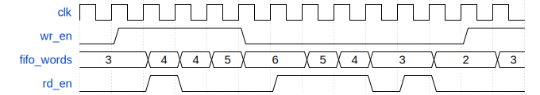

# Controlando a FIFO

FIFO's são elementos de armazenamento de dados muito importantes em situações em que há um fluxo de dados indo de um módulo para outro e o ritmo de geração dos dados é diferente do ritmo de consumo. A FIFO serve para amortecer essa discrepância e permitir a comunicação entre os dois dispositivos.

Para fazer uma comunicação efetiva utilizando FIFO's, é necessário realizar um certo controle sobre a FIFO para garantir que ela

- Não receberá uma tentativa de escrita quando estiver cheia;
- Não receberá uma tentativa de leitura quando estiver vazia.

No primeiro caso, o dado a ser escrito é perdido. No segundo, o dado lido é inválido.

Para fazer esse controle, é preciso acompanhar a quantidade de dados que estão armazenados na FIFO e impedir escritas ou leituras inválidas. Uma maneira de implementar essa solução envolve impedir a FIFO de receber dados quando ela estiver quase cheia e fazê-la voltar a receber dados quando ela estiver quase vazia. Dessa maneira, a FIFO evita entrar em estados inválidos.

## Atividade

### FIFO

Você deve implementar uma FIFO de oito palavras de profundidade com um contador de palavras e também uma máquina de estados. O número de palavras dentro da FIFO será uma de suas saídas. A interface da FIFO é a seguinte:

```verilog
module fifo(
    input   clk,
    input   rst_n,

    // Write interface
    input   wr_en,
    input   [7:0] data_in,
    output  full,

    // Read interface
    input   rd_en,
    output  reg [7:0] data_out,
    output  empty,

    // status
    output reg [3:0] fifo_words  // Current number of elements
);
```
> DICA: modifique a FIFO do exercício anterior para colocar o contador de palavras e também a profundidade de 8.

> DICA: o reset da FIFO desta vez deve ser síncrono: `always @ (posedge clk)`

### FSM

A máquina de estados a ser implementada:
- escreve continuamente na FIFO até detectar 5 palavras e para de escrever no ciclo seguinte
- depois de parar de escrever, aguarda a FIFO esvaziar até ter 2 elementos ou menos para voltar a escrever nela
- quando o número de elementos chega a dois ou menos, a fsm deve começar a escrever no ciclo seguinte

Veja um diagrama com o comportamento dos sinais da fifo. A máquina de estados é responsável por controlar apenas o `wr_en`.



Note que quando `wr_en` e `rd_en` estiverem altos ao mesmo tempo, a contagem de palavras deve se manter fixa, pois foram feitas uma operação de escrita e uma de leitura ao mesmo tempo.

Os dados a serem escritos na FIFO serão, simplesmente, **sempre 0xAA**. O foco deste exercício é a contagem de palavras então os dados não são relevantes.

A interface da máquina de estados é a seguinte:

```verilog
module fsm(
    input   clk,
    input   rst_n,

    output reg wr_en,

    output [7:0] fifo_data,
    
    input [3:0] fifo_words
);
```

## Execução da atividade

Siga o modelo de módulo já fornecido e utilize o testbench e scripts de execução para sua verificação. Em seguida, implemente o circuito de acordo com as especificações e, se necessário, crie outros testes para verificá-lo.

Uma vez que estiver satisfeito com o seu código, execute o script de testes com `./run-all.sh`. Ele mostrará na tela `ERRO` em caso de falha ou `OK` em caso de sucesso.


## Entrega

Realize um *commit* no repositório do **GitHub Classroom**. O sistema de correção automática vai validar sua implementação e atribuir uma nota com base nos testes.

> **Dica:**  Não modifique os arquivos de correção! Para entender como os testes funcionam, consulte o script `run.sh` disponível no repositório.